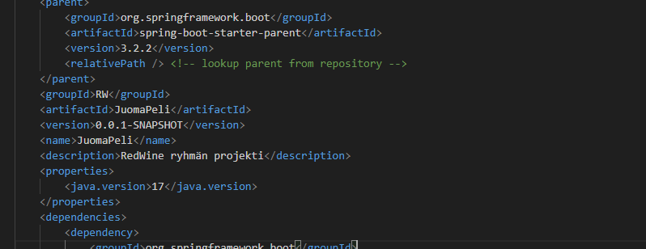
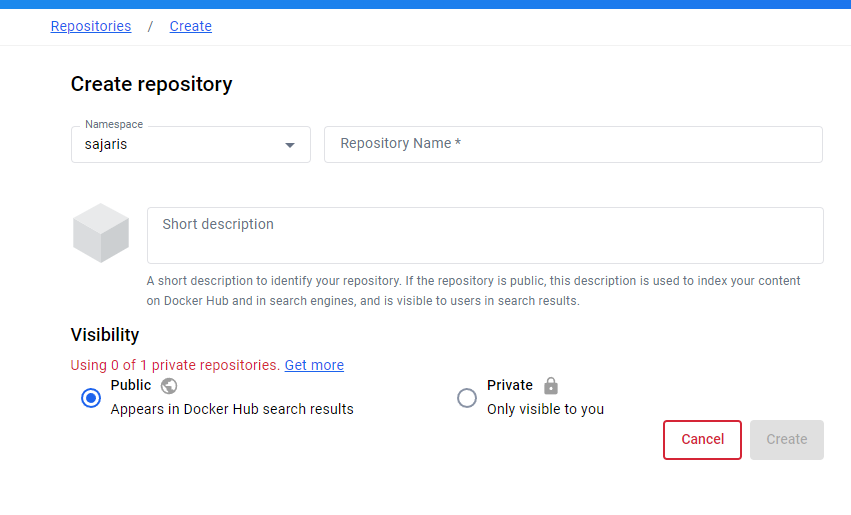
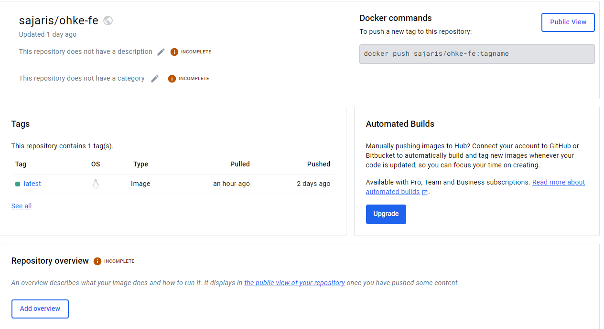
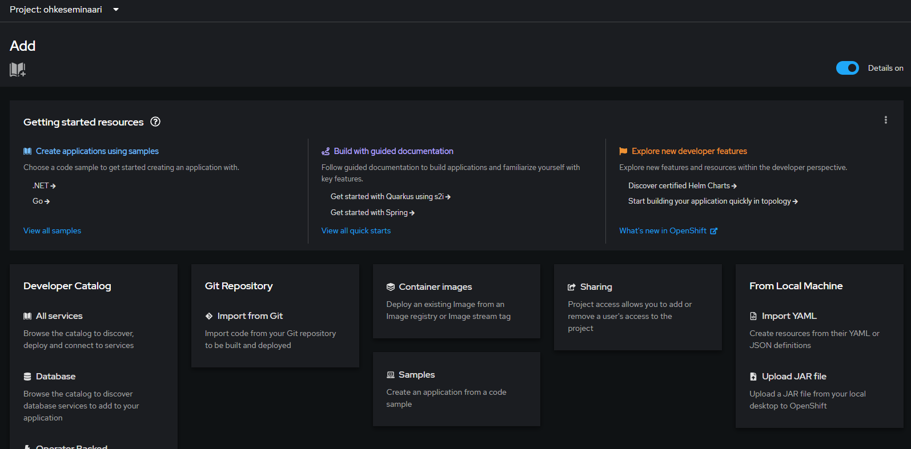
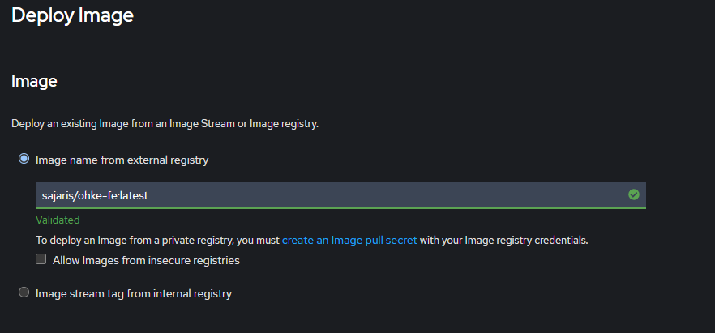
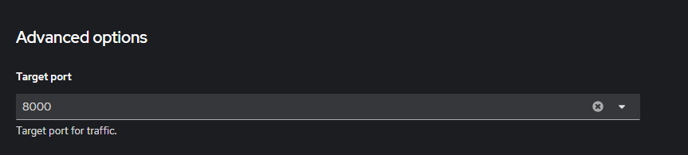
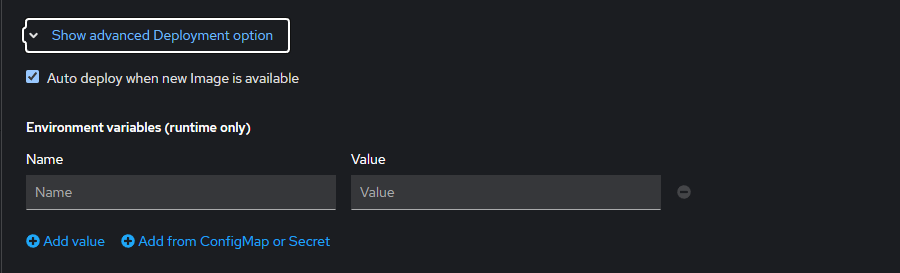
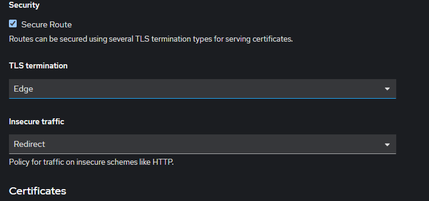
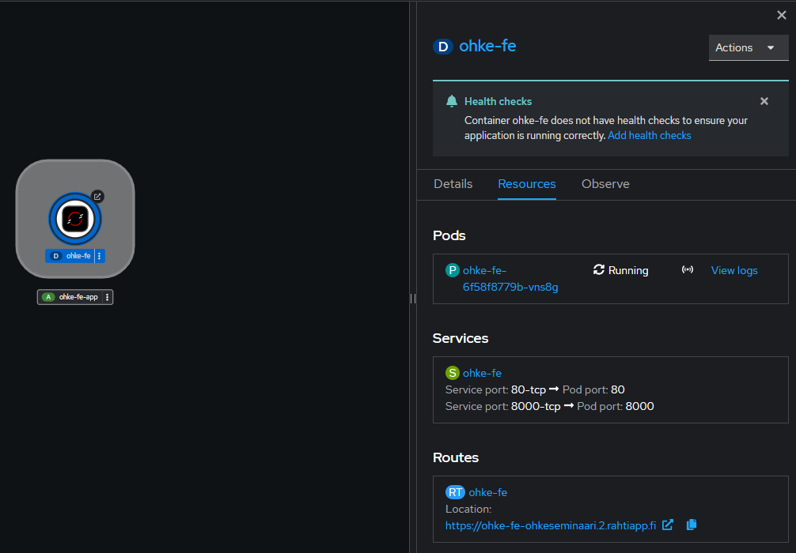

# Esittely

Esityksessä käsitellään miten kokonainen Fullstack projekti voidaan kontittaa ja miten se voidaan julkaista Rahti 2 palveluun valmiiksi luoduilla imageilla.

Seminaarin esimerkki vaatii projektien omien vaatimusten lisäksi vähintään Dockerin, GitHub/DockerHub tilin, sekä pääsyn Rahti 2 palveluun.

### Sisältö
- SpringBoot(Maven) projektin kontitus
- Vite projektin kontitus
- Docker imagen työntäminen DockerHubiin
- Imagen julkaisu Rahti 2 palveluun
- Hyödyt/haitat imagen julkaisusta Rahti 2 palveluun

# SpringBoot(Maven) projektin kontitus

### Valmistelu

SpringBoot projektin kontitusta varten tarvitsee selvittää 2/3 asiaa:
- Javan versio
- Projektin nimi ja versio
- Portti

Portti on vakiona 8080, mutta jos se on vaihdettu se voi löytöä application.properties, application.yml tai koodin sisältä.

Projektin Java version, sekä nimen ja projektin oman version löytää Maven projetkissa molemmat pom.xml tiedostosta.

Alla olevasta esimerkki pom.xml tiedostosta löytyy eri kohdista;
- Java versio = 17
- Projektin nimi = Juomapeli
- Projektin versio = 0.0.1-SNAPSHOT



### Dockerfile luominen

Valmistelun jälkeen projektille on suhteellisen helppo luoda oma Dockerfile.

```
FROM openjdk:17
# Java + projektin java versio

EXPOSE 8080
# Portti

WORKDIR /usr/src/app
# kansio kontin sisällä

COPY . .
# Kopioidaan root kansiosta kaikki paitsi .dockerIgnore:n merkitsemät tiedostot konttiin

RUN ./mvnw package
# Ajetaan kontin sisällä maven wrapper, joka kokoaa projektin yhdeksi .jar tiedostoksi

CMD ["java", "-jar", "./target/JuomaPeli-0.0.1-SNAPSHOT.jar"]
# Kontin käynnistyessä ajettava komento, eli kutsutaan java-tulkki, määritetään että halutaan käynnistää jar tiedosto,
# Ja suoritetaan maven wrapperin kokoama tiedosto, jonka nimi muodostuu seuraavasti <projektin nimi>-<projektin versio>
# Eli JuomaPeli-0.0.1-SNAPSHOT
```

### Imagen luonti

Kun projektille on luotu dockerfile root kansioon, se voidaan muuntaa/rakentaa Imageksi, seuraavalla komennolla. Esimerkissä dockerfile on nimetty juomapeli.Dockerfile
```
docker build -f .\juomapeli.Dockerfile . -t ohke-be

# Build komento, -f eli file kertoo dockerille dockerFilen nimen, "." kertoo dockerille kansion jossa työskennellään,
# eli projektin Root kansio ja -t eli tag kertoo dockerille miten luotu image nimetään ja vaihtoehtoisesti millä tagillä.
```

Luotu image löytyy, joko docker images komennolla listasta tai graafisetsta liittymästä, jos docker desktop on asennettu.

# Vite projektin kontitus

### Valmistelu

Koska tarkoituksena on julkaista projekti OpenShift pohjaiseen Rahti 2 palveluun, clientin kontitus vaatii Nginx config tiedoston. OpenShift ja täten Rahti 2 ei salli portin 80 käyttöä, eikä Root käyttäjän omistamien kansioiden käyttöä, mutta Nginx:in konfiguroinnilla voidaan vaihtaa portti, sekä nginx käyttämä kansio.

Alla olveassa conf tiedostossa tärkeimmät muutokset ovat serverin alla, jossa vaihdetaan portti( listen 8000) ja nginx root kansio( location/ root /code). Conf tiedoston saa projektiin lisäämällä nginx.conf tiedoston root kansioon, josta se myöhemmin kopioidaan konttiin dockerfilessä. 

Conf tiedosto on peräisin Niklas Heidloffin blogista ja siitä on muokattu portti 8080 -> 8000

https://heidloff.net/article/deploying-nginx-on-openshift/
```
# nginx.conf
worker_processes auto;
pid /tmp/nginx.pid;
events {
 worker_connections 1024;
}

http {
 include /etc/nginx/mime.types; 
 client_body_temp_path /tmp/client_temp;
 proxy_temp_path       /tmp/proxy_temp_path;
 fastcgi_temp_path     /tmp/fastcgi_temp;
 uwsgi_temp_path       /tmp/uwsgi_temp;
 scgi_temp_path        /tmp/scgi_temp;

 server {
   listen 8000;
   charset utf-8;
   sendfile on;
   server_name _;
   index index.html;
   error_log  /tmp/error.log;
   access_log /tmp/access.log;
   location / {
     root /code;
     expires -1;
     add_header Pragma "no-cache";
     add_header Cache-Control "no-store, no-cache, must-revalidate, post-check=0, pre-check=0";
     try_files $uri /index.html = 404;
   }
 }
}
```

Muita valmisteluja NPM projektin julkaisuun on halutun Node.js version selvitys, helpoimmalla pääsee kun valitsee lts version. Esimerkki dockerfilessä käytetään 18:ta, mutta sen voisi hyvin korvata esim. :lts-alpine tai :20-alpine tägillä.

Tämän lisäksi Vite ja muut Node projektit vaativat .dockerignore tiedoston projektin root kansioon. .dockerignore toimii samalla tavalla kuin .gitignore, eli sillä kerrotaan dockerille, jos joku kansio/hakemisto tai tiedosto pitää jättää ulkopuolelle. 

Node/Vite tapauksessa node_modules kansio tulee jättää ulkopuolelle, eli .dockerignore tiedostoon lisätään vähintään "node_modules". Myös mahdolliset .env tiedostot, voi tarvittaessa olla hyvä jättää ulkopuolelle, mutta tässä tapauksessa ne pitäisi silti lukea, sillä haluttulopputulos on tuotanto versio projektista.

### Dockerfilen luominen

SpringBootin dockerfileen verrattuna Vite projektissa käytetään kahta base imagea. Nodea jolla rakennetaan tuotanto versio projektista, sekä Nginx:iä joka toimii proxy palvelimena, eli se välittää Noden rakentaman projektin http pyyntöihin.

```
FROM node:18-alpine AS builder
# Luodaan väliaikainen node image ja annetaan sille builder nimi

WORKDIR /app
# Siirrytään /app hakemistoon kontissa

COPY package.json .
# kopioidaan package.json konttiin

RUN npm install
# Asennettaan package.json tiedostossa olevat riippuvuudet

COPY . .
# Kopioidaan projektin lähdekoodi konttiin, 
# eli projektin root kansio kokonaisuudessan .dockerignore määrityksiä lukuunottamatta
# Tämä kopioidaan kontissa /app hakemistoon, johon siirryttiin aikaisemmin

RUN npm run build
# Ajetaan tuotanto version kasaaminen, projektista riippuen voi olla eri komento 
# Vite projektissa se on lähtökohtaisesti run build

FROM nginx:alpine
# kutsutaan Nginx

COPY nginx.conf /etc/nginx/nginx.conf
# Kopioidaan projektin root kansiosta nginx.conf tiedosto 

WORKDIR /code
# Siirrytään nginx.conf tiedostossa määritettyyn hakemistoon, eli /code

COPY --from=builder /app/dist .
# Kopioidaan node imagen luoma /dist hakemisto kokonaisuudessan nginx imagen /code hakemistoon
# Node image kutsutaan sen nimellä, eli tässä tapauksessa builder

EXPOSE 8000
# Asetetaan image kuuntelemaan porttia 8000, joka on sama mikä on määritetty nginx.conf sisällä

CMD ["nginx", "-g", "daemon off;"]
# Asetetaan komento, joka suoritetaan kontin käynnistyksen yhteydessä
# Eli ajetaan nginx, -g asetetaan globaalit asetukset, tässä tapauksessa, kuitenkin tyhjä
# Ja "daemon off", joka estää nginx menemästä "lepotilaan".
```

### Imagen luonti

Imagen luonnissa käytetään samoja komentoja, kuin aikaisemmin. Tässä tapauksessa dockerfilessä ei ole asetettu nimeä.

Teoriassa alla olevalla komennolla
```
docker build . -t ohke-fe
```

Mutta jos docker valittaa: no such file or directory, voidaan asettaa dockerfile manuaalisesti -f parametrillä
```
docker build -f .\.dockerfile . -t ohke-fe
```

# Docker imagen työntö hubiin

Tässä esimerkissä käytetään DockerHubia välikätenä. DockerHubin käyttöä varten vaaditaan tili, mutta GitHub tili toimii myös.

Kirjautumisen jälkeen omat Image löytyvät osoitteesta https://hub.docker.com/repositories/

### Uuden repositorion luonti

Jotta DockerHubiin voidaan työntää image, sitä varten tarvitaan sille oma repo. Repository voi luoda sivulla olevasta napista, josta pääsee siirtymään seuraavaan näkymään.



Syöttämällä nimen, sekä valitsemalla onko repo julkinen vai yksityinen, voidaan luoda Imagelle uusi repositorio.
Namespace on käyttäjän nimi ja se muodostaa nimen kanssa "osoitteen", jolla reposta voidaan vetää tai työntää image.

Kun Repo on luotu avautuu seuraava näkymä



Tästä näkee repon tiedot, sekä komennon, jolla repoon voidaan työntää image. Jos Repoon on työnnetty Image, Tags kohdasta näkee myös eri versiot/tägit. 

### Imagen työntö DockerHub repositoryyn

Imagen työntö voidaan tehdä, joko komennolla tai graaffisen liittymän kautta. 

Työntöä varten Image kuitenkin pitää olla nimetty oikein, eli esim. Vite image joka koottiin nimellä "ohke-fe", pitää vaihtaa luotuun repositoryn nimeen, eli "sajaris/ohke-fe".

Imagen nimen ja tägin voi vaihtaa seuraavalla komennolla. Jos tägin jättää tyhjäksi, se menee defaulttina :latest tägiin
```
docker tag <vanha nimi>:<vanha tägi> <uusi nimi>:<uusi tägi>
# Eli tässä tapauksessa
docker tag ohke-fe sajaris/ohke-fe  
```

Kun imagen nimi on vaihdettu voidaan työntää se repoon seuraavalla komennolla, jolloin se menee :latest tägillä.
```
docker push sajaris/ohke-fe
```

# Imagen julkaisu Rahti 2 palveluun

Rahti 2 palvelun käyttö vaatii projektin csc:ä, mutta sitä ei käsitellä tässä.

Rahti 2 sisältää kaksi erillista näkymää, jonka voi valita sivuvalikosta, Developer ja Administrator. Developer tilasta löytyy +Add kohta, josta aukeaa näkymä, joka sisältää eri vaihtoehtoja palveluiden lisäämiseksi projektiin. 



Tästä näkymästä, valitaan "Container images", mutta se sisältää myös erillaisia lisäämis tapoja, joista voi olla hyötyä eri tilanteissa.

Valinnan jälkeaan aukeaa Deploy Image form, johon halutaan täyttää vähintään seuraavat tiedot seuraaviin kohtiin.

DockerHubin repon nimi. Tällä kertaa myös tägi kannattaa sisälltyyää, eli sajaris/ohke-fe:latest


Imagen EXPOSE kohdassa oleva portti, Vite:n tapauksessa 8000, spring bootin 8080


Jos on tarvittavaa asettaa ympäristömuuttujia, se löytyy "Advanced Deployment option" alta.


Koska konttiin halutaan päästä ulkopuolelta käsiksi, valitaan "Create a route" kohta. "Advanced Routing options" alta löytyy asetuksia, jonka alta halutaan valita "Secure Route". Spring Bootin tapauksessa, on myös tarpeellista valita "Insecure traffic" alta "Allow". Viten tapauksessa, sen voi myös lisätä, jos konttiin ei saa yhteyttä selaimella.



### Lisäämisen jälkeen

Kun kontti on luotu, se siirtyy Topology kohtaa, josta sitä voidaan hallita. 

Topologystä, myös ilmenee Route kohdan alta myös osoite, jolla konttiin pääsee käsiksi.


# Hyödyt/haitat imagen julkaisusta Rahti 2 palveluun

Seminaarityön aikana alkuperäinen Rahti, jota oli tarkoitus käyttää, vaihtui kokonaan Rahti 2 palveluksi. Käytettävyyden kannalta isoin muutos oli Rahti 2 kankeus käytetyn imagen kanssa. 

Rahti palvelussa kontin pystyi konfiguroimaan käyttämään suoraan dockerhubista vedettyä imagea, eli kun kontin käynnisti uudestaan, se automaattisesti hakee :latest tägillä tuoreimman version DockerHubista, kun taas Rahti 2 vaatii ImageStreamin väliin, joka haittaa merkittävästi käytettävän imagen päivitystä tuorempaan versioon.

Täyttä varmuutta ei ole siitä mikä laukaisee uuden version haun DockerHubista, mutta se on kuitenkin mahdollista.
10.5.2024, FE kontin päivityksen yhteydessä huomattu ainoa tapa saada päivitys konttiin, oli luoda oma uusi ImageStream ja käyttää sitä kontissa, joka on aika iso ero verrattuna Rahdin tapaan käynnistää kontti uudelleen ja hakea päivitys sitä kautta.

Hyötynä DockerHubin käytössä on ylimääräisten palveluiden ja kirjautumisien karsiminen, ideaalisesti kontti voidaan päivittää pelkästään sillä että DockerHubiin työnnetään uusi versio ja esim. webHookilla laukaistaan konttien redeploy, joka imee uuden imagen ja suorittaa ajon sillä. 

Imagejen käyttö mahdollistaa myös image registryjen käytön, johon voidaan suoraan image ImageStreamin käytettäväksi, mutta nykyisillä tunnuksillä ei se onnistunut itseltäni.

### Tiivistelmä
#### Hyödyt
- Helpo käyttää
- Mahdollistaa työntämisen ilman oc konsolia ja tunnuksia
- Image Registry voi helpottaa vielä enemmän
- Valmiin paketin julkaisuun loistava keino

#### Haitat
- Rahti 2 tuoma kankeus DockerHubin kanssa
- Vaatii jonkin näköistä osaamista Dockerista
- Mahdolliset käyttöoikeus ongelmat, esim. nginx kanssa

# Linkit ja lähteet

- Esimerkkinä käytetty projekti, muokattu esimerkkiä varten: https://github.com/SajariS/JuomaPeli
- Esimerkin julkaistu demo(Rahdin takia ei toimi hirveän pitkään): https://ohke-fe-ohkeseminaari.2.rahtiapp.fi/
- Niklas Heidloff, Deploying Nginx on OpenShift: https://heidloff.net/article/deploying-nginx-on-openshift/